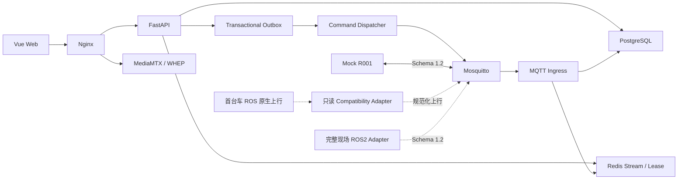

# 智能灭火机器人云控平台

ROBOT-Web 是智能灭火机器人项目的云端与 Web 平台。Robot Integration Contract 为 `1.2.0`（frozen legacy）；MQTT Schema 双版本共存：`1.2`（frozen legacy，向后兼容）与 `1.3`（current vehicle bridge contract）。服务器同时接受 1.2/1.3，未知版本显式 reject。

## 1. 项目简介

平台提供机器人监控、地图版本、报警、任务、手动控制安全租约、命令/ACK、历史、审计、媒体接入、Mock Robot、自动测试、备份恢复和服务器部署包。

## 2. 职责边界

本仓库负责 Vue、FastAPI、PostgreSQL、Redis、Mosquitto、MQTT ingress、dispatcher、worker、WebSocket、MediaMTX、RBAC、审计和部署运维。

本仓库**不开发** ROS2 节点、SLAM、Nav2、传感器/相机驱动、底盘、灭火执行机构、车端 watchdog 或物理急停。平台与车端唯一业务边界是 `MQTT + Media Protocol`。

## 3. 当前版本与状态

- 平台：`ui/youdao-light-hmi-v1`（approved release ref）
- 合同：`1.2.0`（frozen legacy）
- Schema：`1.2`（frozen legacy）+ `1.3`（current bridge contract）
- 本机 DEV/TEST：可运行
- SERVER：部署就绪，未在第二台服务器实际部署
- 真车/真实视频：待现场接入

## 4. 架构



详细说明见 [架构文档](docs/系统架构.md)。

## 5. 功能矩阵

| 能力 | 状态 |
| --- | --- |
| 登录、refresh rotation、RBAC、审计 | 完成 |
| 实时位置、状态、传感器、Snapshot/Delta | 完成 |
| Manual Lease、TTL、stop、software e-stop | 平台/Mock 完成；首台 ROS1 真车下行未实现 |
| Transactional Outbox、ACK、任务状态 | 完成 |
| Site/Map Version/车位/点位/轨迹 | 完成 |
| 自动/人工火情、去重、灭火任务 | 完成 |
| Media ticket 与 MediaMTX HTTP 鉴权 | 完成 |
| 工业 HMI、预设点、巡检计划与三格式报告 | 完成 |
| ROS 原生上行只读兼容与显式设备绑定 | 完成 |
| 真实 ROS2、真车、真实视频 | 现场输入待接 |

## 6. 技术栈

Vue 3、TypeScript、Vite、Pinia、FastAPI、SQLAlchemy 2、Alembic、PostgreSQL 18、Redis 8、Mosquitto 2、MediaMTX、Nginx、Pytest、Vitest、Playwright。

## 7. 目录

```text
apps/                 Web 与 API
services/             ingress、dispatcher、worker、Mock、protocol tester
packages/             canonical Schema 与生成模型
integration/ros2/     现场 ROS2 对接交付源文件
infra/                Broker、Media、Nginx、容器配置
docs/                 中文工程文档
scripts/              启停、测试、备份、preflight、handoff 构建
```

## 8. Windows 快速启动

前置条件：Git、Docker Desktop、WSL2 后端。详细步骤见 [Windows 入门](docs/Windows快速开始.md)。

```powershell
git clone git@github.com:guolichen007/ROBOT-Web.git C:\Users\13576\Desktop\web_robot
Set-Location C:\Users\13576\Desktop\web_robot
Copy-Item .env.example .env
.\scripts\dev.ps1
```

## 9. Bootstrap 登录

DEV 首次启动生成一次性 `admin` 密码并仅在终端显示一次；首次登录必须改密。SERVER 密码只允许通过 Docker secret file 注入，不进入 Git 或日志。

## 10. URLs

- Web：<http://localhost:8080>
- API docs（仅 DEV/TEST）：<http://localhost:8080/api/docs>
- Live：<http://localhost:8080/health/live>
- Ready：<http://localhost:8080/health/ready>
- Metrics（DEV/内部管理网）：<http://localhost:8080/metrics>

## 11. 停止与重置

```powershell
.\scripts\stop.ps1
.\scripts\reset.ps1
```

`reset.ps1` 会清理项目 DEV 数据卷，执行前阅读脚本提示并确认目标目录。

## 12. 测试

```powershell
.\scripts\test.ps1
docker compose -f compose.test.yml --profile full up -d --build --wait
docker compose -f compose.test.yml --profile full down --volumes
```

完整门禁见 [测试文档](docs/测试指南.md)。

## 13. DEV / TEST / SERVER

- `compose.dev.yml`：真实 MQTT Mock、demo seed、本机调试端口。
- `compose.test.yml`：隔离数据库/Redis、媒体测试源、故障注入。
- `docker-compose.server.yml`：Mock OFF、demo OFF、TLS/ACL/secrets、最小公网暴露。

## 14. Mock Robot

Mock R001 是独立 MQTT client，遵循 Schema 1.2；真车 Vehicle Bridge 上行 Schema 1.3。禁止直接调用 API/DB。支持 reboot、丢包、延迟、重复、乱序、错误 Schema、时钟偏差、迟到/重复/错误 ACK 等故障注入。

## 15. ROS2 边界与交付

现场包源目录为 [integration/ros2](integration/ros2/现场对接说明.md)。构建：

```powershell
.\scripts\build-ros2-handoff.ps1
```

输出 `dist/firebot-ros2-integration-1.2.0.zip` 与 `.sha256`。平台不会猜测现场 ROS topic、速度、量程、地图或视频地址。

首台实车是 ROS1 Noetic。当前只读兼容接口、麦克纳姆 `vy` 安全处理、AMCL/odom 边界、缺失急停能力、`cmd_vel` 仲裁阻塞项及运行态清单见 [ROS1 Noetic 实车只读兼容接入说明](docs/ROS原生兼容接入说明.md) 和 [integration/ros1](integration/ros1/ROS1运行态只读验收清单.md)。该只读兼容路径保持 1.2。车端下行由 Vehicle Bridge（schema 1.3）承担，见 [integration/ros1/vehicle-bridge](integration/ros1/vehicle-bridge/README.md) 与 [真实车 Bridge 部署](docs/REAL_VEHICLE_BRIDGE_DEPLOYMENT.md)。

## 16. 服务器部署

从空 Ubuntu 部署见 [Ubuntu SERVER 部署](docs/Ubuntu服务器部署.md)。执行 `scripts/server-preflight.sh` 通过后才允许启动 SERVER profile。

## 17. 安全说明

SERVER 公网默认只开放 80（跳转）、443（HTTPS/WSS/WebRTC gateway）和 8883（MQTT TLS）。ready、metrics、MediaMTX admin API 不公网开放。漏洞报告流程见根目录 [SECURITY.md](SECURITY.md)。

## 18. 视频状态

浏览器通过平台签发的短时 media ticket 访问 WHEP；ticket 绑定用户、机器人、摄像头和过期时间。未登录、越权或过期返回 401/403。没有真实流时页面明确显示 OFFLINE，不伪造 LIVE。

## 19. Troubleshooting

端口、Docker、数据库、MQTT、R001 offline、WebSocket、租约、ACK、地图、boot、Media、备份和 TLS 排查见 [故障排查](docs/故障排查.md)。

## 20. 文档索引

统一入口：[docs/文档索引.md](docs/文档索引.md)。API、数据库、运维、安全、协议、坐标、车辆安全合同和发布检查均从该索引进入。

本轮工业中控、右侧检测、巡检计划/报告和首台真车只读兼容说明见 [工业中控与巡检升级说明.md](docs/工业中控与巡检升级说明.md)、[巡检与预设位置接口.md](docs/巡检与预设位置接口.md) 与 [ROS原生兼容接入说明.md](docs/ROS原生兼容接入说明.md)。Canonical MQTT 为 1.2（frozen legacy）+ 1.3（current bridge contract）；服务器同时接受 1.2/1.3，未知版本显式 reject。

## 21. Git 与贡献流程

功能/修复分支通过 PR 合入 `develop`，全部 required checks 通过后再由 PR 合入 `main`。禁止 force push、删除主线和绕过失败测试。详见 [CONTRIBUTING.md](CONTRIBUTING.md)。

## 22. License 状态

**当前未声明开源许可证，未经仓库所有者明确授权，不得复制、分发或用于其他项目。** License 选择属于 `OWNER_DECISION`。
