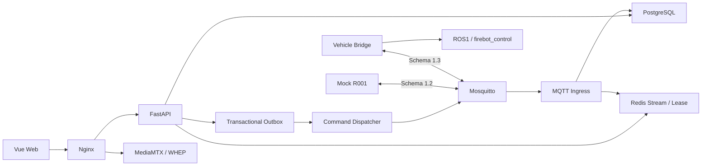

# 智能灭火机器人云控平台

ROBOT-Web 是智能灭火机器人项目的云端与 Web 平台。Robot Integration Contract 为 `1.2.0`（frozen legacy）；MQTT Schema 双版本共存：`1.2`（frozen legacy，向后兼容）与 `1.3`（current vehicle bridge contract）。服务器同时接受 1.2/1.3，未知版本显式 reject。

## 当前状态

> 唯一当前状态真相源见 [docs/当前状态/当前状态.md](docs/当前状态/当前状态.md)（机器可读见 [approved-baseline.yaml](docs/当前状态/approved-baseline.yaml)）。

三个版本真相必须区分，不能混写：

| 概念 | 值 | 含义 |
|---|---|---|
| `APPLICATION_CODE_BASELINE` | `4fd3e59d39190b6fab0688aa01e80f1e4cca4a86` | 最后通过软件 CI 的产品代码基线（Run76） |
| `SERVER_RUNTIME_SHA` | `584efcfda60b8d39c516a9939bc0481609fc6f3c` | 当前生产服务器**真实运行**版本 |
| `SERVER_DB` | `20260902_0008` | 当前生产数据库 revision |

- 最终 `main` 可能因 docs / repository governance 提交而晚于 `4fd3e59`，但**不改变** `4fd3e59` 的产品代码语义。
- `main` 更新**不表示**服务器会自动部署；服务器运行版本始终以 runtime tag 与部署 manifest 为准。
- 正式 Release：`HOLD`。真实运动：`NO`。现场验收：`PENDING`。

## 架构



## 已验证软件能力（Run76，非真实底盘验收）

- `Web → API → Dispatcher → MQTT → Vehicle Bridge → ROS → Control` 软件控制链。
- STOP 安全合同：STOP POST 202 → 任务取消 → STOP ACK → **5 条独立新鲜观测静止确认** → `VEHICLE_STATIONARY_CONFIRMED`。
- 多车（R001/R002）任务与媒体隔离、active vehicle 切换与持久化。
- Web renderer 无 `emitsOptions` / runtime fatal。

## 仍未验证的现场能力（Field Gate，不等于软件 PASS）

- 真实底盘运动、真实 odom、`control_mode=3`、cmd_vel 仲裁、真实 STOP、真实 PATROL。
- 样机2：`SAMPLE2=OFFLINE`，现场最终验收 `PENDING`。

## 技术栈

Vue 3、TypeScript、Vite、Pinia、FastAPI、SQLAlchemy 2、Alembic、PostgreSQL 18、Redis 8、Mosquitto 2、MediaMTX、Nginx、Pytest、Vitest、Playwright。

## 目录

```text
apps/                 Web 与 API
services/             ingress、dispatcher、worker、Mock、protocol tester
packages/             canonical Schema 与生成模型
integration/ros1/     车端 Bridge / Control / firebotctl / Fleet Profile
integration/ros2/     现场 ROS2 对接交付源文件
infra/                Broker、Media、Nginx、容器配置
docs/                 中文工程文档（当前状态 / 部署运维 / 技术合同 / 开发验收）
scripts/              启停、测试、备份、preflight、handoff 构建
```

## 文档入口

唯一文档索引见 [docs/README.md](docs/README.md)。

## 新设备接入流程

新设备接入只使用 `firebotctl`（`integration/ros1/firebotctl`），标准顺序：

```text
Tailscale 登录
  → 输入 DEVICE_ID
  → firebotctl vehicle enroll
  → firebotctl vehicle install
  → firebotctl vehicle verify
  → READY
```

明确：不按车辆手工修改源码；不为每台车复制一个支线；不手工维护一套车辆专属 MQTT topic / DB readiness / ROS 配置源码。详见 [车端部署与实车接口](docs/部署运维/车端部署与实车接口.md)。

## GitHub 分支策略

- 长期分支只保留 `main`。
- 临时分支：`feature/*`、`fix/*`、`maintenance/*`、`field/*`、`release/*`，完成即删除。
- 历史 `develop` / `integration/**` / `hardening/**` 已收敛，不再作为开发流程分支。
- 详见 [GitHub分支与版本治理](docs/开发验收/GitHub分支与版本治理.md)。

## 服务器部署原则

- 服务器只接受 **exact 40 位 SHA** 部署，不接受「拉最新」。
- 服务器运行版本由 runtime tag + 部署 manifest + 镜像 OCI revision 三重证明。
- 部署流程见 [服务器部署](docs/部署运维/服务器部署.md) 与 [仓库封板与发布流程](docs/开发验收/仓库封板与发布流程.md)。

## License 状态

**当前未声明开源许可证，未经仓库所有者明确授权，不得复制、分发或用于其他项目。** License 选择属于 `OWNER_DECISION`。
