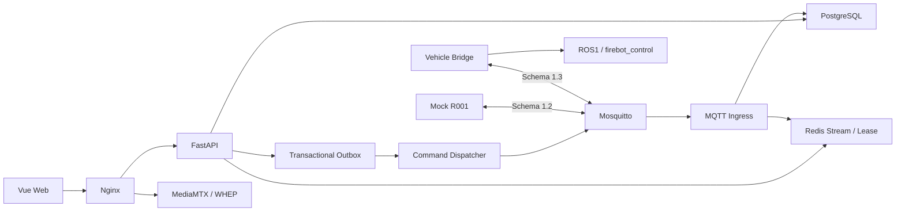

# 智能灭火机器人云控平台

ROBOT-Web 是智能灭火机器人项目的云端与 Web 平台。Robot Integration Contract 为 `1.2.0`（frozen legacy）；MQTT Schema 双版本共存：`1.2`（frozen legacy，向后兼容）与 `1.3`（current vehicle bridge contract）。服务器同时接受 1.2/1.3，未知版本显式 reject。

## 当前状态

> 唯一当前状态真相源见 [docs/当前状态/当前状态.md](docs/当前状态/当前状态.md)（机器可读见 [approved-baseline.yaml](docs/当前状态/approved-baseline.yaml)）。

- 长期主线：`main`（仓库整理与 CI/文档维护提交均落在 `main`）。
- 服务器当前真实运行基线：`584efcfda60b8d39c516a9939bc0481609fc6f3c`，对应不可变 tag `baseline/server-runtime-2026-09-03`。
- 数据库 revision：`20260902_0008`。
- 服务器封板：`SERVER_FINAL_SEAL=PASS`。
- 样机2：`SAMPLE2=OFFLINE`；样机2 最终现场验收：`PENDING`。
- 正式 Release：`HOLD`（等样机2 现场验收通过后再走 Release 流程）。
- 注意：仓库整理/CI/文档提交可能领先服务器运行 SHA，这**不表示服务器会自动升级**；服务器运行版本始终以 tag `baseline/server-runtime-2026-09-03` 为准。

## 架构



**软件控制核心链已证明**：`Web → API → Dispatcher → MQTT → Vehicle Bridge → ROS → Control`（含 STOP 安全机制与 5 条独立新鲜观测静止确认）。

**真实运动最终验收仍待样机现场**：真实底盘 / 真实 odom / control_mode=3 / cmd_vel 仲裁 / 真实 STOP / 真实 PATROL。

## 技术栈

Vue 3、TypeScript、Vite、Pinia、FastAPI、SQLAlchemy 2、Alembic、PostgreSQL 18、Redis 8、Mosquitto 2、MediaMTX、Nginx、Pytest、Vitest、Playwright。

## 目录

```text
apps/                 Web 与 API
services/             ingress、dispatcher、worker、Mock、protocol tester
packages/             canonical Schema 与生成模型
integration/ros1/     车端 Bridge / Control / firebotctl / Fleet Profile
integration/ros2/     现场 ROS2 对接交付源文件
infra/                Broker、Media、Nginx、容器配置
docs/                 中文工程文档（当前状态 / 部署运维 / 技术合同 / 开发验收）
scripts/              启停、测试、备份、preflight、handoff 构建
```

## 文档索引

唯一文档索引见 [docs/README.md](docs/README.md)。

## 车端部署

新设备接入只使用 `firebotctl`（`integration/ros1/firebotctl`），除 Tailscale 登录 + 输入设备编号 + 一次性 enrollment token 外，不手改 env/DB。详见 [车端部署与实车接口](docs/部署运维/车端部署与实车接口.md)。

## License 状态

**当前未声明开源许可证，未经仓库所有者明确授权，不得复制、分发或用于其他项目。** License 选择属于 `OWNER_DECISION`。
