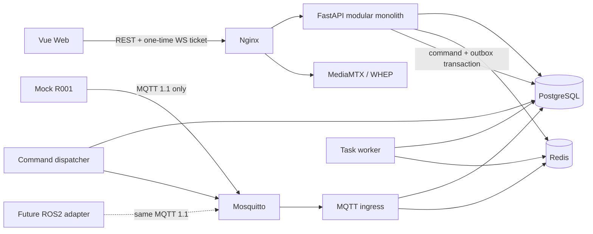

# Architecture

The platform uses a Vue 3 browser client, a modular FastAPI application and three independent process roles where separation has a reliability purpose: MQTT ingress, command dispatcher and task worker. PostgreSQL owns business facts; Redis owns short-lived realtime state, leases and the replayable event stream.

## Reliability boundaries

- REST snapshots carry a Redis Stream watermark. WebSocket uses a 60-second, one-use ticket and replays after that watermark before live delivery. An expired replay window returns `resync_required`.
- Durable commands commit command and outbox rows in one transaction. Dispatcher retries preserve `command_id`; QoS 1 is at-least-once.
- Manual pulses use a separate Redis Pub/Sub fast path and cannot accumulate or replay. Redis atomic NX+TTL provides one lease per robot; PostgreSQL stores the session summary.
- Safety stop/e-stop uses a priority Redis Stream, bypassing task FIFO. UI success still requires a valid ACK/task terminal status.
- 10 Hz latest telemetry stays in Redis; PostgreSQL stores configured 1 Hz history. Time-partitioned telemetry and sensor tables keep default partitions.

The browser never connects to MQTT, RTSP, DDS or ROS topics.
